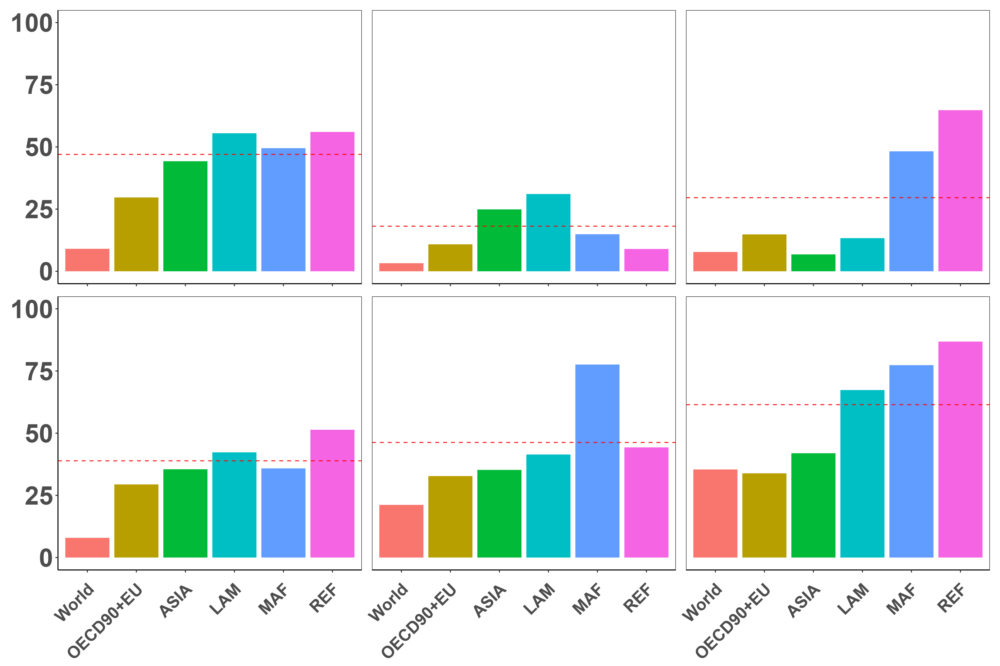
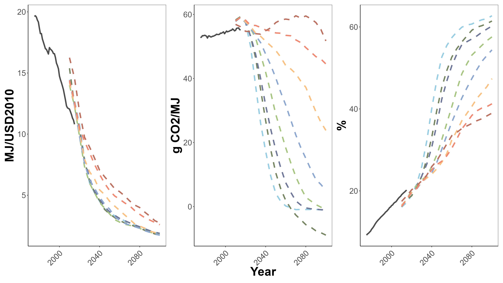
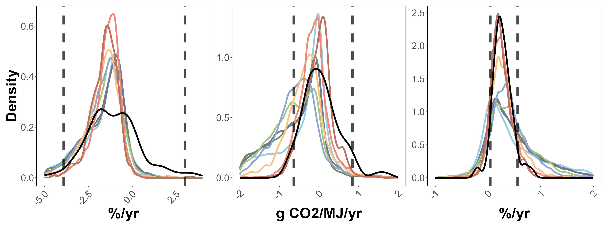
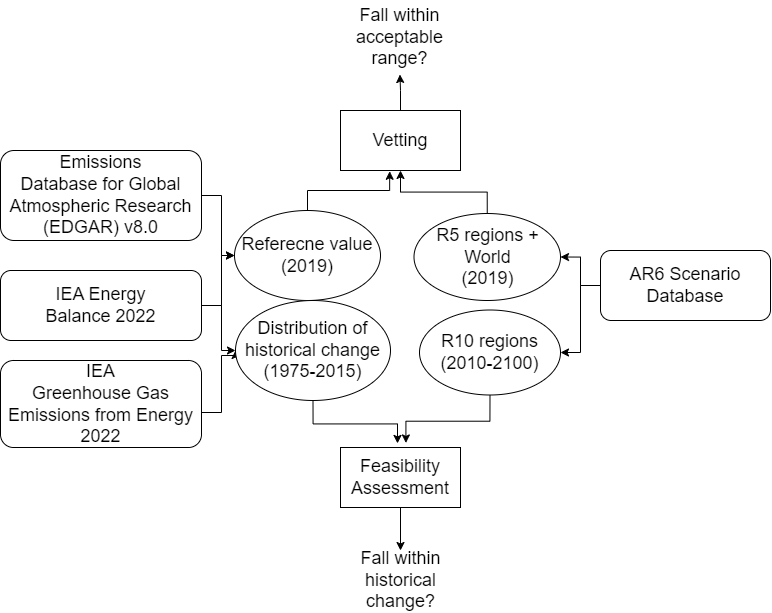

# Extension of Verification and Evaluation Method for Climate Mitigation Scenario: Considering Regional and Historical Information

Henry Chan (2024 graduate), Environmental Engineering Course, Kyoto University

## Introduction
This repo is about my graduate thesis on
extending the existing method for evaluating climate mitigation scenairo.

Keywords: *Climate change mitigation*, *Integrated assessment models*, *Scenario analysis*, *Validity*, *Feasibility*

## Abstract
As the urgency for climate change mitigation measures intensifies, there is growing interest among policymakers and researchers in assessing the validity and feasibility of scenarios projected by integrated assessment models (IAMs), which has been used to depict future socio-economic system considering the impact of policies. Validity guarantees scenario quality by ensuring the reproducibility of historical trends and near-term projections, while Feasibility offers practical insights for decision-making by evaluating the degree of projection aligning with societal capacities for change.

Although IPCC Sixth Assessment Report (AR6) demonstrated global vetting for validity and literature-based feasibility assessments, concerns arise due to the lack of regional vetting and doubts about the appropriateness of indicator values. This study aims to extend the current approach by applying (1) regional vetting, which examines if scenarios fall within acceptable range from regional reference values, and (2) feasibility assessment framework which compares scenarios to distribution of historical change, on the AR6 scenario database. The effectiveness of this extension is evaluated by comparing results with the existing approach.

## Key Findings
- Regional vetting shows average passing rate for regions are **25% lower** than global counterpart, suggesting necessary review on assumptions and mechanisms regulating regional projection in IAMs with global scope.
- Feasibility assessment shows major concern arises from **carbon intensity** and **electrification rate**, proving versality of the newly adopted method as it aligns with literature.
- However, carbon intensity shows decreasing concern in scenarios with limited temperature increase. This contrasts to the result of AR6 and requires adjustment of method to capture characteristics of scenarios.

Full pdf is available. Please refer to `graduation_thesis.pdf`.

## Figures

*Regional failing rate (%) per vetting test. Red line shows the average of regions, which is above the world.*
*(1st row from left to right: CO2 emissions, CO2 emissions % change, CH4 emissions; 2nd row from left to right: primary energy supply, electricity from nuclear power, electricity from renewable source;)*
--------------------------------

*Trend & projection of feasibility indicators. Solid line shows the historical trend. Dotted line shows scenario projection. Color shows climate categories of scenario.*
*(From left to right: energy intensity, carbon intensity, electrification rate)*
--------------------------------

*Distirbution of (rate of) change of feasibility indicators. Black line shows the historical distribution. Dotted line shows 90% coverage of historical distribution. Color shows climate categories of scenario.*
*(From left to right: energy intensity, carbon intensity, electrification rate)*
-------------------
For in-depth explanation, plesase refer to `presentation.pdf`. 

## Workflow

## Note
- Due to license restriction, input data used for the study is not included in this repo.
- Therefore, the purpose of this repo is for demonstration, but not for reproducibility.

